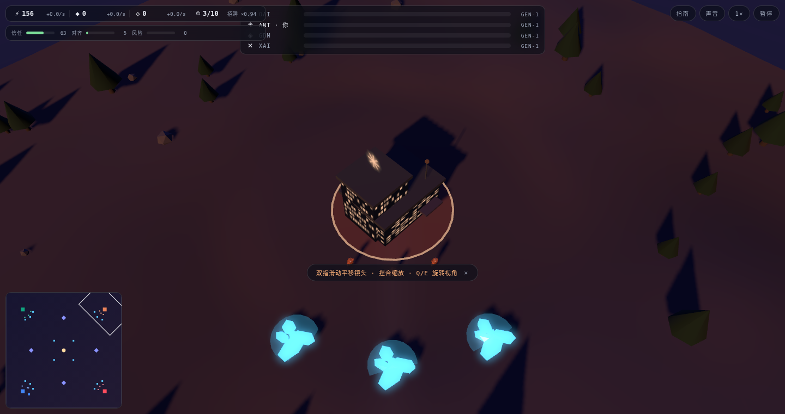

# ASI 竞赛



语言：[EN](README.md) | [ZH-CN](README.zh-CN.md) | [ZH-TW](README.zh-TW.md) | [JA](README.ja.md) | [FR](README.fr.md)

ASI 竞赛是一款在浏览器中运行的 3D 即时战略游戏。四家 AI 实验室风格的阵营围绕算力、数据、人才、政府影响力、公众信任、风险控制和对齐展开竞赛。最先完成 ASI 训练的一方会结束比赛；摧毁所有对手总部也能获胜。

> 这是一个非官方戏仿项目。项目与 OpenAI、Anthropic、Google DeepMind、xAI 或任何真实实验室无关联、未获背书；阵营设定是基于公开印象的游戏化改写，不包含真实人物。

## 从源码运行

本仓库保存的是从 Fable 生成包中抽出的共享浏览器游戏源码，并已经包含 `vendor/three.module.js`，因此源码版可以直接通过任意本地静态服务器运行。

```bash
python3 -m http.server 8000
# 打开 http://localhost:8000
```

运行无界面模拟测试：

```bash
npm test
# 等价于 node test/headless.mjs
```

## 发行版下载

GitHub 发行版 `v1.0.0` 包含两个原始平台压缩包：

- `asi-race-mac-zh.zip`：macOS 包，包含应用包和启动脚本。
- `asi-race-win-zh.zip`：Windows 包，包含命令启动器和 PowerShell 本地服务器启动器。

如果缺少 `three.module.js`，两个平台启动器都会在首次联网启动时自动下载。下载完成后，游戏可以离线运行。仓库源码版已经直接包含该文件。

## 操作

| 输入 | 动作 |
| --- | --- |
| 双指滑动 | 平移镜头 |
| 捏合 / ctrl+滚轮 | 缩放 |
| 双指点按 / 右键 | 智能命令：移动、采集、攻击、集结 |
| 单击 / 拖框 / shift | 选中、框选、加选 |
| Q / E、WASD / 方向键、H | 旋转、平移、回总部 |
| ctrl+1-4 / 1-4 | 保存 / 召回编队 |
| A + 点击 | 攻击移动：部队推进途中自动清剿敌人 |
| Tab | 轮选空闲研究员（并跳转镜头） |
| 空格 | 跳转到最近一次遇袭地点 |
| P、F、M、Esc、? / F1 | 暂停、二倍速、静音、取消、手册 |

游戏内置五页战地手册，覆盖目标、操作、经济、政治与信任、结局。

## 玩法

- 算力来自总部、数据中心和可占领的 GPU 集群。
- 数据由研究员从地图节点采集，高阶实验楼可自动产出合成数据。
- 影响力来自国会游说，可用于出口管制、算力补贴、监管调查和公关攻势。
- 人才决定单位上限，信任影响招聘成本和被挖角风险。
- 抢跑研发会积累风险，对齐研究可降低事故压力并影响结局。
- 战场覆盖战争迷雾：单位与建筑提供视野，探索过的区域转为灰色记忆，敌方建筑只保留你最后一次看到的样子；小地图同步受迷雾限制，唯有 ASI 训练的光柱全图可见。
- 胜利路线包括 Gen-2、Gen-3、Gen-4 / AGI 到 ASI 训练，也可以摧毁所有对手总部。

可玩阵营受 OpenAI、Anthropic、Google DeepMind 和 xAI 启发，每一方都有不同的经济或安全倾向加成。

## 项目结构

```text
index.html            浏览器入口
css/                  HUD、开始页、战场覆盖层样式
js/sim/               确定性模拟层，不依赖 DOM 或 three.js
js/view/              three.js 表现层、地形、建筑、角色、特效
js/ui/                HUD 与游戏内教程
js/audio/             WebAudio 音效和环境配乐
js/shared/            模拟与渲染共用函数
test/headless.mjs     Node 模拟层测试
vendor/               vendored three.js v0.170.0
packaging/            从 macOS 和 Windows 包中抽出的启动器源码
```

模拟层以固定 0.1 秒步长推进。渲染层读取状态并播放插值表现效果。AI 玩家与真人玩家使用同一套命令 API。

## 原始提示词译文

```text
为我构建一款可游玩的浏览器 3D 即时战略游戏，采用类似帝国时代的俯视视角，
把它做成通往超级智能的 AI 竞赛隐喻。阵营包括 OpenAI、Anthropic、
Google DeepMind 和 xAI，每个阵营都要有受品牌启发的身份，并拥有符合其
个性的加成。

不要只是给即时战略游戏换皮；要从这个隐喻中发明机制。思考这些实验室真正
竞争的东西，例如算力、数据、人才、政府支持和公众观感，并把它们变成经济、
科技进度和胜利条件。对手实验室应该是真正的 AI 对手，和玩家一起竞速；整局
游戏应以某一方率先抵达超级智能而结束。

使用 Three.js，采用普通 ES 模块，不需要构建步骤，只依赖本地静态服务器。
全部素材都要来自真实下载的高质量素材，不要使用 AI 生成素材。角色应该是
带骨骼绑定的模型，能够通过骨骼动画真正行走、工作和战斗。让它具有电影感
和爽快反馈：戏剧化灯光、真实阴影、每个动作都有反馈效果，并提供完整声景：
战斗、建造和警报都使用真实音效，底下有安静的背景音乐。

控制方式优先考虑触控板，覆盖层 HUD 要干净，并提供游戏内玩法指南。保持模拟
和渲染分离，并在构建过程中实时在浏览器中验证每个系统，而不是最后才验证。
```

## 资产说明

原始提示词要求使用真实下载资产。当前 Fable 产出的包实际只依赖下载版 Three.js；建筑、角色几何、骨骼动画姿态、贴图、音效和环境音乐均由项目代码程序化生成。本仓库保留这一实现状态，并把 Three.js 固定为 `0.170.0`，以便源码版直接运行。
